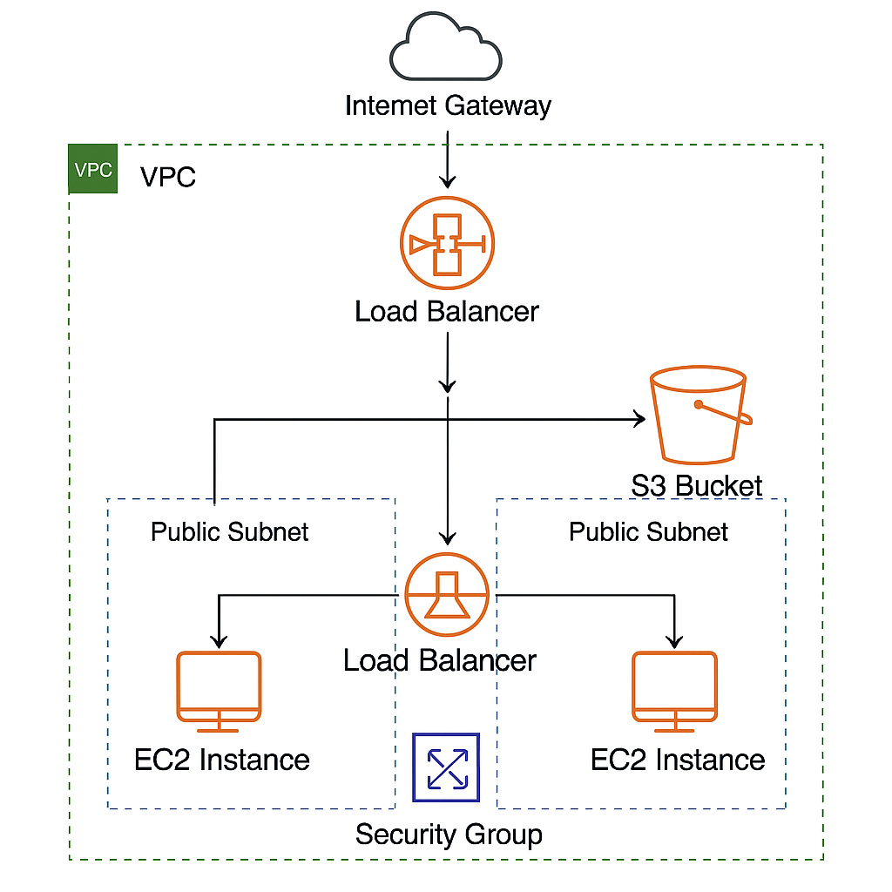

# AWS Two-Tier Web Architecture with Terraform

This Terraform project provisions a highly available, scalable web infrastructure on AWS. It creates a custom VPC environment with public subnets, EC2 instances, a load balancer, and an S3 bucket.

## 🚀 What This Project Does

- **VPC & Subnets**: Custom VPC with two public subnets in different AZs (`us-east-1a` and `us-east-1b`) for high availability.
- **Internet Gateway & Routing**: Enables internet access by associating the route table with an internet gateway.
- **Security Groups**: Allows HTTP (port 80) and SSH (port 22) traffic from any IP.
- **EC2 Instances**: Deploys two `t2.micro` web servers across different subnets, using separate user-data scripts.
- **Load Balancer (ALB)**: Routes HTTP traffic to instances with target group attachment and health checks.
- **S3 Bucket**: Creates a public S3 bucket (optionally for static asset hosting or backups).
- **Output**: Returns the ALB DNS for browser access.

## 🏗️ Resources Created

| Resource                  | Description                             |
|---------------------------|-----------------------------------------|
| `aws_vpc`                | Custom virtual network                   |
| `aws_subnet`             | Two subnets in separate AZs             |
| `aws_internet_gateway`   | Enables outbound access                  |
| `aws_route_table`        | Routing configuration                    |
| `aws_security_group`     | Allows SSH and HTTP                      |
| `aws_instance`           | Two EC2 web servers                      |
| `aws_lb`                 | Application Load Balancer                |
| `aws_lb_target_group`    | Routes traffic to EC2 instances          |
| `aws_s3_bucket`          | S3 bucket named `dhruvilterrafromawsproject2025` |
| `output`                 | DNS of ALB for quick access              |

## 🌐 Access the Application

Once provisioning is complete, access the deployed app via the ALB DNS:

## 💡 Prerequisites

- AWS CLI configured
- Terraform installed
- Valid AWS credentials

.png)

.png)

.png)

.png)

.png)
